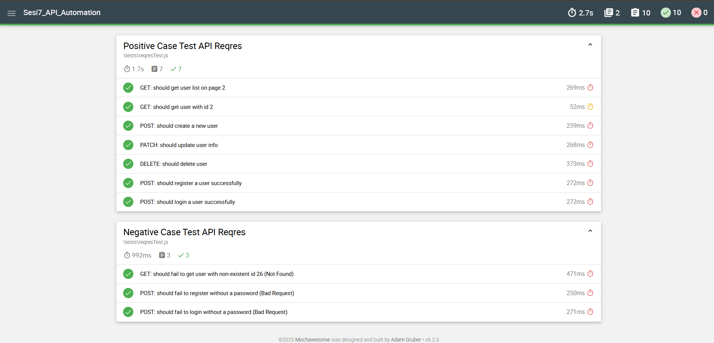

# 🔍 Sesi7_API_Automation

Project ini adalah bagian dari **Digital Skola kelas QA Engineer batch 10**.  
Dalam project ini dilakukan **API Automation Testing** terhadap endpoint [https://reqres.in](https://reqres.in) menggunakan:

- ✅ Mocha
- ✅ Chai
- ✅ Mochawesome (Test Reporter)

---

## 📦 Teknologi yang Digunakan

- Node.js (v18+)
- Mocha (framework pengujian)
- Chai (assertion library)
- Mochawesome (HTML report generator)
- Native `fetch()` dari Node.js v18+

---

## 📝 Dokumen Terkait
📄 [Test Plan](https://docs.google.com/document/d/1GedZ0GAm_H1hiBM44Zun03QIYyzUW5Q4DkeCKIa4R7g/edit?usp=sharing)

---

## 🧪 Daftar Pengujian API Reqres

✅ Kasus Positif (Positive Case)

- **GET** - Mengambil daftar pengguna di halaman 2.
- **GET** - Mengambil data satu pengguna dengan ID 2.
- **POST** - Membuat pengguna baru dengan data `name` dan `job`.
- **PATCH** - Memperbarui informasi pengguna dengan ID 2.
- **DELETE** - Menghapus pengguna dengan ID 2.

---

❌ Kasus Negatif (Negative Case)

- **GET** - Gagal mendapatkan pengguna dengan ID yang tidak ada (ID 26), mengharapkan status `404 Not Found`.
- **POST** - Gagal mendaftarkan pengguna tanpa *password*, mengharapkan status `400 Bad Request`.
- **POST** - Gagal login tanpa *password*, mengharapkan status `400 Bad Request`.

---

## 📁 Struktur File

```
Sesi7_API_Automation/
├── tests/
│   └── reqresTest.js           # GET, POST, PATCH, DELETE
├── mochawesome-report/         # Output report HTML
└── package.json
```

---

## ▶️ Cara Menjalankan

### 1. Install dependensi:
```bash
npm install
```

### 2. Jalankan semua pengujian:
```bash
npm run test
```

> Ini akan menjalankan seluruh file di dalam folder `tests/` dan menghasilkan **report otomatis** dalam format HTML.

---

## 📊 Hasil Test Report (Mochawesome)

Berikut adalah **hasil visual** dari pengujian otomatis:




---

## 👨‍💻 Author

Rifqi Abdillah – [GitHub](https://github.com/rfqabdillah)
