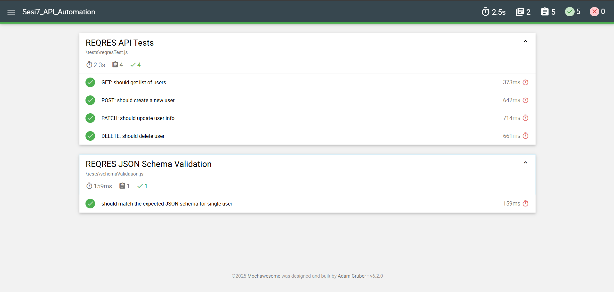

# 🔍 Sesi7_API_Automation

Project ini adalah bagian dari **Digital Skola kelas QA Engineer batch 10**.  
Dalam project ini dilakukan **API Automation Testing** terhadap endpoint [https://reqres.in](https://reqres.in) menggunakan:

- ✅ Mocha
- ✅ Chai
- ✅ Ajv (JSON Schema Validator)
- ✅ Mochawesome (Test Reporter)

---

## 📦 Teknologi yang Digunakan

- Node.js (v18+)
- Mocha (framework pengujian)
- Chai (assertion library)
- Ajv (JSON schema validation)
- Mochawesome (HTML report generator)
- Native `fetch()` dari Node.js v18+

---

## 🧪 Daftar Pengujian

1. ✅ **GET** list of users  
2. ✅ **POST** create user (dengan header `x-api-key`)  
3. ✅ **PATCH** update user info (dengan header `x-api-key`)  
4. ✅ **DELETE** user (dengan header `x-api-key`)  
5. ✅ **JSON Schema Validation** untuk endpoint `GET /users/2`

---

## 📁 Struktur File

```
Sesi7_API_Automation/
├── tests/
│   ├── reqresTest.js           # GET, POST, PATCH, DELETE
│   └── schemaValidation.js     # Validasi struktur JSON response
├── mochawesome-report/         # Output report HTML
└── package.json
```

---

## ▶️ Cara Menjalankan

### 1. Install dependensi:
```bash
npm install
```

### 2. Jalankan semua pengujian:
```bash
npm run test
```

> Ini akan menjalankan seluruh file di dalam folder `tests/` dan menghasilkan **report otomatis** dalam format HTML.

---

## 📊 Hasil Test Report (Mochawesome)

Berikut adalah **hasil visual** dari pengujian otomatis:




---

## 👨‍💻 Author

Rifqi Abdillah – [GitHub](https://github.com/rfqabdillah)
